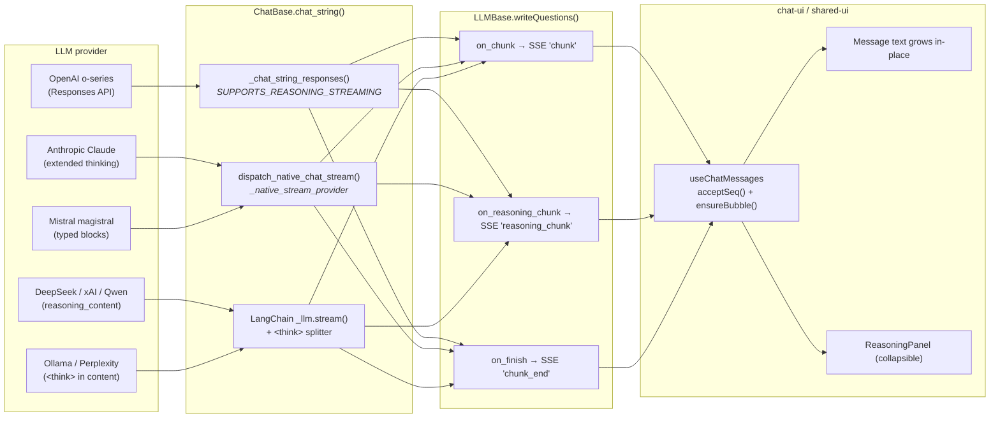

# LLM Streaming & Reasoning

How tokens — both the visible answer and the model's chain-of-thought — travel from a provider SDK to the chat UI as Server-Sent Events.

## Flow



## Three streaming paths (in dispatch order, `ChatBase.chat_string`)

| # | Gate | Used by |
|---|---|---|
| 1 | `SUPPORTS_REASONING_STREAMING=True` + `_raw_client.responses` | OpenAI o-series, gpt-5 family (special case) |
| 2 | `self._native_stream_provider` set (registered in `llm_native_stream.py`) | `anthropic` (extended thinking, special case); `openai_compat_reasoning` — **auto-wired by ChatBase** for any OpenAI-compatible driver |
| 3 | Generic `_llm.stream()` loop with inline `<think>` splitter | Perplexity sonar-reasoning (CoT embedded in content), plain GPT-4, every other LangChain `ChatOpenAI` driver |

If a path raises or yields nothing the loop falls through to `_chat_with_retries(prompt)` (non-streaming) so the user still gets an answer.

### Why `openai_compat_reasoning` exists — and why it needs no per-provider code

`langchain-openai` (1.2.x) explicitly drops non-standard delta fields like `reasoning_content` from the streamed chunks. Providers that speak OpenAI Chat Completions but emit reasoning in that field (DeepSeek, GMI Cloud, Qwen, xAI, Ollama, …) would lose their CoT going through LangChain. The handler bypasses LangChain by calling the raw `openai` SDK whose Pydantic models keep extra fields.

**No driver wires this.** `ChatBase._ensure_openai_compat_reasoning_stream()` runs at stream time: if `capabilities.reasoning` is set (from services.json) and the driver's `_llm` is OpenAI-compatible (has `openai_api_base`), ChatBase builds the raw `openai` client from the base URL / key already on `_llm` and routes through the handler. Enabling reasoning for a new OpenAI-compatible model is therefore **just a services.json update** — zero code.

```python
# A typical OpenAI-compatible driver needs NOTHING beyond its normal _llm:
class Chat(ChatBase):
    def __init__(self, ...):
        super().__init__(...)
        self._llm = ChatOpenAI(model=..., base_url=..., api_key=...)
        # reasoning streaming is auto-wired by ChatBase from capabilities.reasoning
```

### Special cases (non-OpenAI protocols)

These do not fit the generic path and set their handler explicitly:

| Provider | Why special | Status |
|---|---|---|
| **Anthropic** | Messages API + `thinking_delta` events + explicit `thinking` enable | In this PR (`_native_stream_provider='anthropic'`) |
| **OpenAI** o-series/gpt-5 | Responses API (`reasoning_summary_text.delta`), not Chat Completions | In this PR (`SUPPORTS_REASONING_STREAMING`) |
| **Mistral** magistral | Mistral SDK typed `thinking` blocks | Follow-up PR |
| **Perplexity** sonar-reasoning | CoT inline in `<think>` tags (generic path #3) | Follow-up PR |

## SSE event contract [per discussion #752](https://github.com/rocketride-org/rocketride-server/discussions/752#discussioncomment-16806337)

```jsonc
// chunk: visible answer token
{ "text": "...", "seq": 0, "runId": 42, "nodeId": "llm_openai_1", "ts": 1715... }

// reasoning_chunk: chain-of-thought / thinking-summary delta
{ "text": "...", "seq": 0, "runId": 42, "nodeId": "llm_openai_1", "ts": 1715... }

// reasoning_end: emitted once when reasoning_chunk stream is finished
{ "seq": 12, "runId": 42, "nodeId": "llm_openai_1", "ts": 1715... }

// chunk_end: final event, carries finishReason
{ "finishReason": "stop", "seq": 42, "runId": 42, "nodeId": "llm_openai_1" }
```

`seq` is per-stream-key (`runId:nodeId`); the UI uses `acceptSeq()` to drop out-of-order / duplicate deltas defensively (the engine guarantees order today).

## How each provider surfaces reasoning

| Provider | Source field | Driver flag | Notes |
|---|---|---|---|
| **OpenAI** o1/o3/o4/gpt-5 | `response.reasoning_summary_text.delta` | `SUPPORTS_REASONING_STREAMING` (special case) | Responses API; `reasoning.summary='auto'` |
| **Anthropic** claude-4-* | `thinking_delta` (Messages API) | `_native_stream_provider='anthropic'` (special case) | Extended-thinking models |
| **Any OpenAI-compatible** (DeepSeek, GMI Cloud, Qwen, xAI, Ollama, …) | `delta.reasoning_content` | **auto-wired by ChatBase** from `capabilities.reasoning` | Zero per-provider code; raw `openai` SDK built from `_llm` |

> **Deferred to follow-up PRs:** Mistral (magistral typed blocks via Mistral SDK) and Perplexity (`<think>` inline) are non-generic and added per-provider. Some OpenAI-compatible models (Qwen `enable_thinking`, Ollama/xAI `reasoning_effort`) also need an extra request param to emit `reasoning_content`; those params are added per-provider once verified.

The `<think>` splitter is a stateful closure in `chat.py` (`_make_think_tag_splitter`) — it tolerates tags split across stream deltas and falls through transparently when no tags are present.

## Failure modes

- **Provider rejects streaming** → caught, `warning()` logged, falls back to non-streaming `_chat_with_retries`.
- **No `.stream()` on `_llm`** → skipped, falls back to `_chat_with_retries`.
- **`LLMBase.writeQuestions` raises** → emits an error chunk + `chunk_end{finishReason:'error'}` + fallback `Answer` so the chat-ui lane is never empty.

## Adding a new provider

1. If the provider streams via OpenAI-compatible Chat Completions and emits `reasoning_content` on deltas → **nothing to do**. Build the normal `ChatOpenAI` `_llm` with its `base_url`; ChatBase auto-wires the reasoning stream from `capabilities.reasoning`. Enable it per-model in services.json.
2. If it uses `<think>` tags inline → **no change needed**, the splitter handles it.
3. If it needs the **Responses API**: set `SUPPORTS_REASONING_STREAMING = True` and assign `self._raw_client` to an `OpenAI()`-compatible client in `__init__` (`ChatBase` already reads `self._is_reasoning` from `capabilities.reasoning`).
4. If it needs a **custom SDK** (Anthropic/Mistral-style): write a handler in `llm_native_stream.py`, register it, and set `self._native_stream_provider = '<key>'` in the driver's `__init__`.
